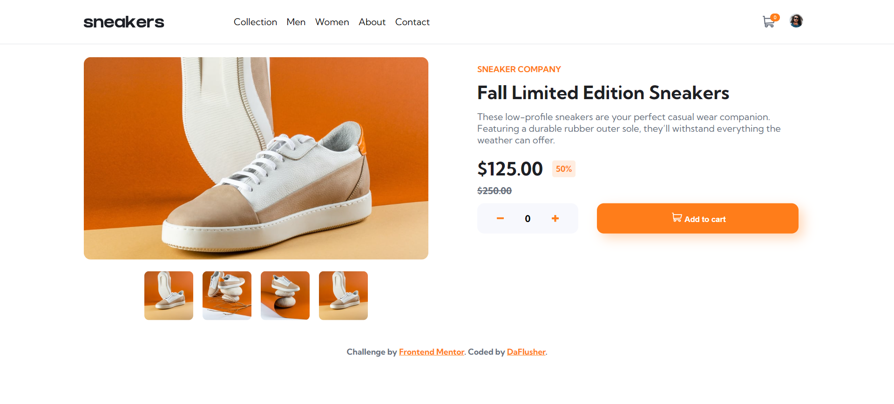

# Frontend Mentor - E-commerce product page solution

This is a solution to the [E-commerce product page challenge on Frontend Mentor](https://www.frontendmentor.io/challenges/ecommerce-product-page-UPsZ9MJp6). Frontend Mentor challenges help you improve your coding skills by building realistic projects.

## Table of contents

- [Overview](#overview)
  - [The challenge](#the-challenge)
  - [Screenshot](#screenshot)
  - [Links](#links)
- [My process](#my-process)
  - [Built with](#built-with)
  - [What I learned](#what-i-learned)
  - [Continued development](#continued-development)
  - [Useful resources](#useful-resources)
- [Author](#author)
- [Acknowledgments](#acknowledgments)

## Overview

### The challenge

Users should be able to:

- View the optimal layout for the site depending on their device's screen size
- See hover states for all interactive elements on the page
- Open a lightbox gallery by clicking on the large product image
- Switch the large product image by clicking on the small thumbnail images
- Add items to the cart
- View the cart and remove items from it

### Screenshot

### Links

- Solution URL: [Add solution URL here](https://github.com/DaFlusher/FEM-ecommerce-product-page-main)
- Live Site URL: [Add live site URL here](https://fem-ecommerce-product-page-main.vercel.app/)

## My process

### Built with

- Semantic HTML5 markup
- Sass
- Flexbox
- CSS Grid
- Mobile-first workflow
- [React](https://reactjs.org/) - JS library
- [Vite.js](https://github.com/vitejs) - React framework
- [ReactjsExample](https://reactjsexample.com/a-customizable-extendable-and-modern-react-lightbox-component/) - For LightBox style

### What I learned

React really makes modular development easier. It has a really large ecosystem with developers eager to help out. I learned to equally use sass to style my components. 

### Continued development

Working on the add to cart button functionality. Currently, pressing the plus or minus buttons immediately adds the items to the users cart.

Customizing the lightbox further as iluustrated in the initial design.
Using modular patterns for sass styling.

Finally updated the lightbox via react modal component, with some customizations

### Useful resources

- [reactjsexample](https://reactjsexample.com/a-customizable-extendable-and-modern-react-lightbox-component/) - This helped me when I was stuck with the lightbox. 
- [CodeCademy](https://www.codecademy.com/courses/react-101/lessons/your-first-react-component) - They have an amazing react course that really helped broaden my knowledge of the useStae and useEffect hooks and props.
-[w3schools](https://www.w3schoolscom) - Always my go to site.
- [chatgpt](https://www.openai.com) - I recently began using the chatGPT to supercharge my coding experience.
- [react modal github page]('https://github.com/reactjs/react-modal) - I made use of their modal component.

## Author

- Website - [Joy Ibe](https://www.your-site.com)
- Frontend Mentor - [@yourusername](https://www.frontendmentor.io/profile/DaFlusher)
- Twitter - [@yourusername](https://www.twitter.com/@Joyibe17)

## Acknowledgments

Special thanks to Igor Danchenko, the author of the initial lightbox component I used, shared via reactjsexample.com
Special thanks to the authors of the react modal compomnent available on github (link to the repo is available above).

